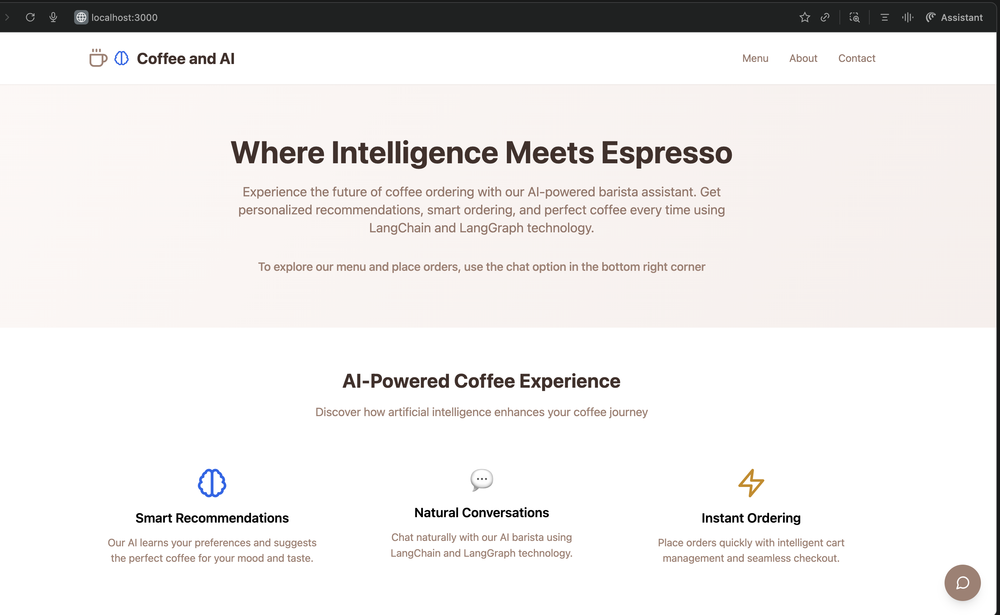
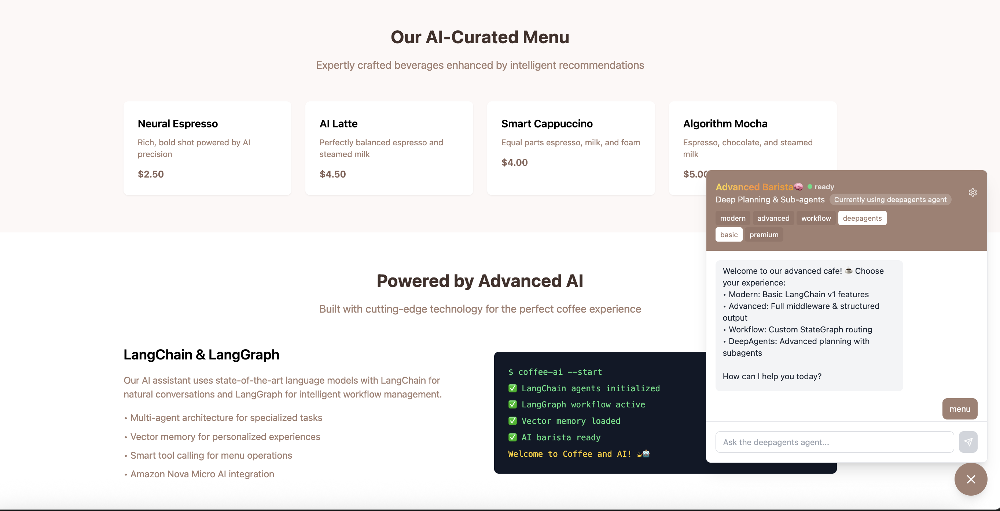
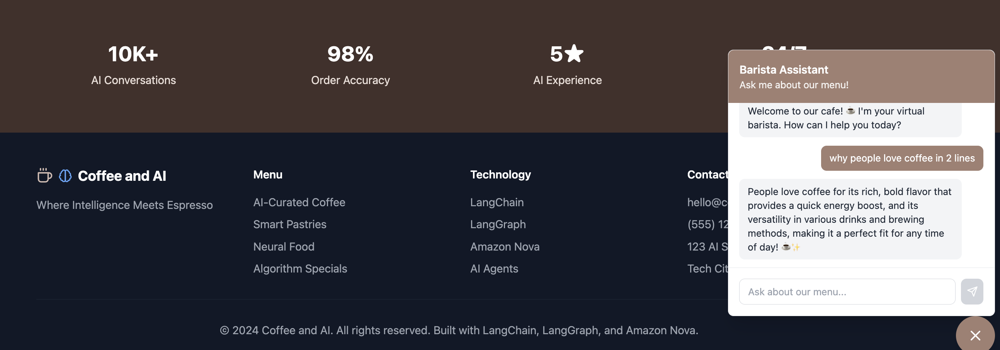
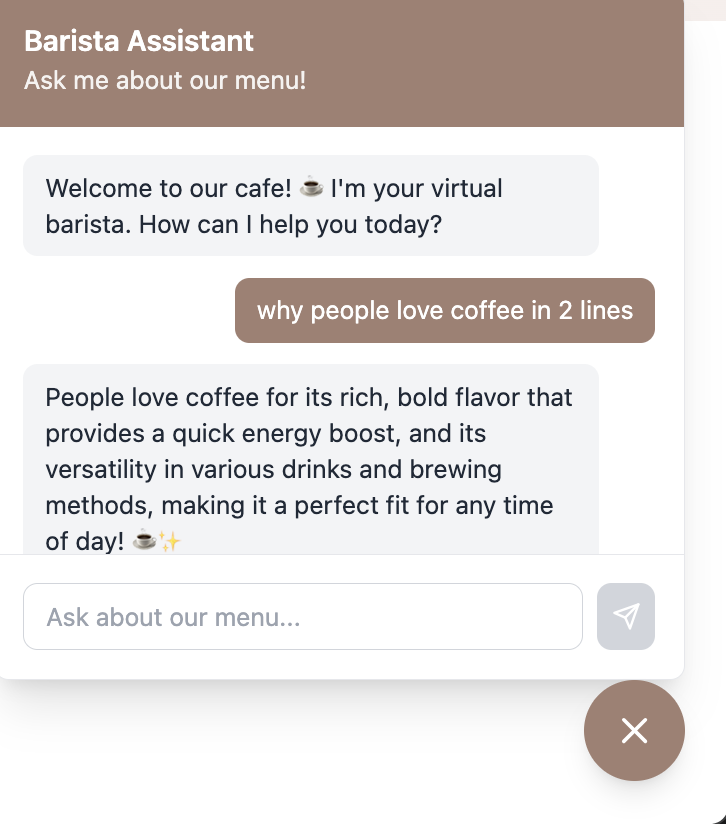
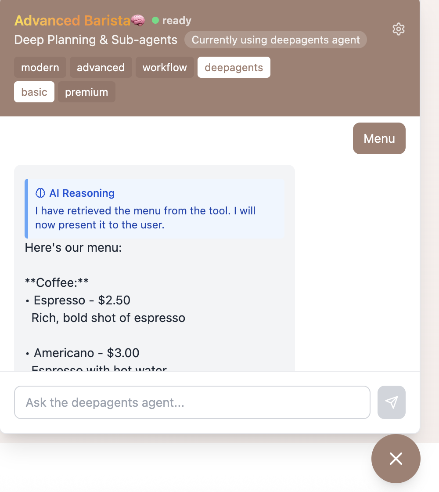
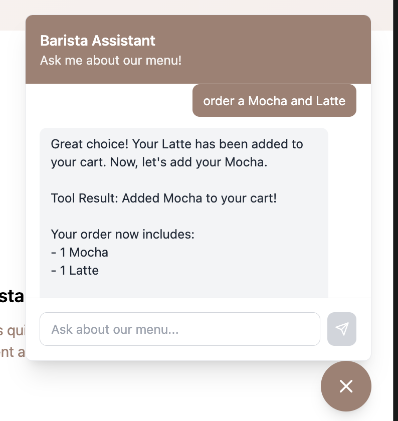
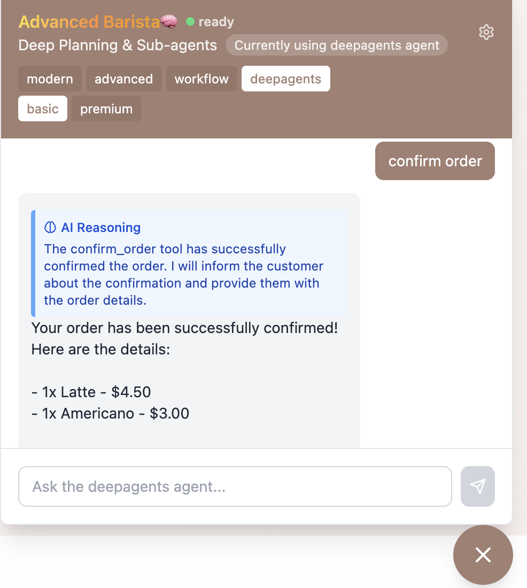
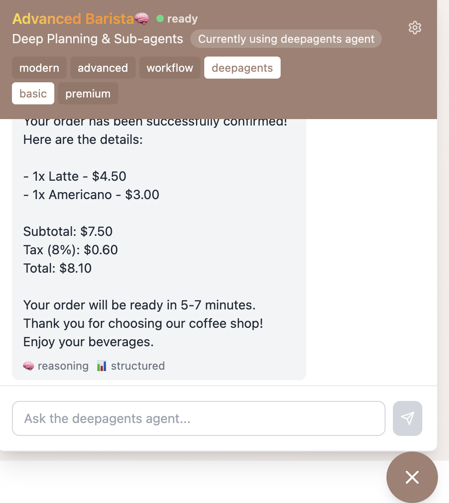

# Barista Agentic App

A professional cafe application with AI-powered chatbot using multi-agent architecture, built with FastAPI, Next.js, PostgreSQL, and AWS Bedrock.

## Screenshots


*Landing page with Modern Design and AI features showcase*


*Homepage showing LangChain & LangGraph technology stack*


*Homepage with Menu, Tech and Contact Details*


*General question with AI Reasoning: "why people love coffee in 2 lines" - shows thinking process before natural response*


*Menu display with AI Reasoning - agent explains "I have retrieved the menu from the tool" before showing coffee items*


*Adding Latte and Americano with AI Reasoning showing successful cart addition confirmation*


*Order confirmation with AI Reasoning, detailed breakdown: 1x Latte ($4.50), 1x Americano ($3.00), Subtotal, Tax (8%), Total ($8.10), and "ready in 5-7 minutes" message*


*Complete order confirmation showing full details with subtotal, tax calculation, total, and delivery time estimate*

## Features

- **Multi-Agent Architecture**: Specialized agents for menu, orders, and confirmations
- **AI-Powered Chat**: Natural language ordering using AWS Bedrock Nova Lite model
- **Professional UI**: Modern landing page with integrated chatbot
- **Real-time Ordering**: Add items to cart, view totals, and confirm orders
- **Database Integration**: PostgreSQL with Tortoise ORM and Aerich migrations

## Tech Stack

- **Backend**: FastAPI, LangChain (prerelease), LangGraph, Tortoise ORM, Aerich
- **Frontend**: Next.js, TypeScript, Tailwind CSS
- **Database**: PostgreSQL
- **AI**: AWS Bedrock (Nova Lite)
- **Deployment**: Docker Compose

## Quick Start

1. **Clone and setup**:
   ```bash
   cd baristaapp
   cp .env.example .env
   ```

2. **Configure AWS credentials** in `.env`:
   ```
   AWS_ACCESS_KEY_ID=your_access_key
   AWS_SECRET_ACCESS_KEY=your_secret_key
   AWS_REGION=us-east-1
   ```

3. **Run the application**:
   ```bash
   docker-compose up -d --build
   ```

4. **Access the application**:
   - Frontend: http://localhost:3000
   - Backend API: http://localhost:8000
   - API Docs: http://localhost:8000/docs

## Usage

1. Visit http://localhost:3000
2. Click the chat button in the bottom right
3. Try these commands:
   - "Show me the menu"
   - "Add a latte to my order"
   - "Show my cart"
   - "Confirm my order"

## Architecture

### Multi-Agent System
- **Menu Agent**: Handles menu queries and recommendations
- **Order Agent**: Manages cart operations and pricing
- **Confirmation Agent**: Processes order confirmations
- **Coordinator Agent**: Routes conversations between agents

### Database Schema
- **menu_items**: Coffee, pastries, and food items
- **customers**: Session-based customer tracking
- **orders**: Order history and status tracking

## Development

### Backend Development
```bash
cd backend
pip install --pre -U langchain
pip install -r requirements.txt
uvicorn app.main:app --reload
```

### Frontend Development
```bash
cd frontend
npm install
npm run dev
```

### Database Migrations
```bash
cd backend
aerich init -t app.core.database.TORTOISE_ORM
aerich init-db
aerich migrate
aerich upgrade
```

## API Endpoints

- `POST /api/chat` - Chat with AI assistant
- `GET /api/menu` - Get menu items
- `GET /api/orders/{session_id}` - Get user orders
- `WS /api/ws/{session_id}` - WebSocket chat connection

## Environment Variables

See `.env.example` for required configuration.

## License

MIT License
