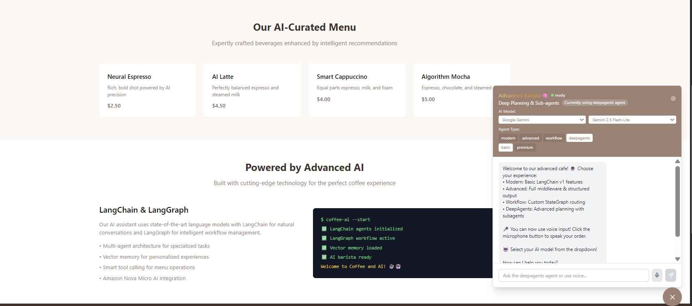

# Barista Agentic App

A professional cafe application with AI-powered chatbot using multi-agent architecture, built with FastAPI, Next.js, PostgreSQL, and AWS Bedrock.

## 🎉 Latest Updates

### Slack Integration
We've integrated **Slack notifications** to keep your team informed in real-time:
- 🟢 **New User Registrations** - Get notified when someone joins
- 🟠 **New Orders** - Instant alerts with order details (ID, customer, total, items)
- 🔵 **Order Ready** - Notify when orders are ready for pickup
- ⚡ **Async & Non-blocking** - Doesn't slow down your app
- 🔧 **Easy Setup** - Just add your Slack webhook URL to `.env`

**Test it:** Run `python backend/test_slack.py` to verify your setup!

---

## 🆕 New Features

### 🔐 Authentication System
- ✅ User registration and login with JWT tokens
- ✅ Password hashing with bcrypt for security
- ✅ Protected routes for authenticated users
- ✅ Admin-only endpoints for user management
- ✅ Profile dropdown with user information
- ✅ Order history accessible through user profile

### 📧 Email Notifications
- ✅ Welcome emails on registration with professional HTML templates
- ✅ Order confirmation emails with detailed breakdown (Subtotal, Tax 8%, Total)
- ✅ Order ready notifications
- ✅ Admin bulk email capabilities
- ✅ Gmail SMTP integration with app-specific passwords
- ✅ Automatic email sending when logged-in users place orders

### 💬 Slack Notifications
- ✅ Real-time notifications to Slack workspace
- ✅ New user registration alerts (green notification)
- ✅ New order notifications with order details (amber notification)
- ✅ Order ready for pickup alerts (blue notification)
- ✅ Webhook-based integration with rich message formatting
- ✅ Non-blocking async notifications
- ✅ Works with all agent types (Modern, Advanced, Workflow, DeepAgents)

### 📊 Order Management
- ✅ Complete order history for authenticated users
- ✅ Tax calculation (8%) displayed in orders and emails
- ✅ Order status tracking (Pending, Confirmed, Preparing, Ready, Completed)
- ✅ Real-time order updates in user profile


## Screenshots


*Landing page with Modern Design and AI features showcase*


*Homepage showing technology stack*


*user registration*


*Logged in Customer Details*


*Chat Interface*


*User asking Whats in the menu - AI reasoning and menu is shown*


*User adding an item - AI reasoning with adding to cart is shown*


*Order confirmation - Complete details with subtotal, tax calculation, and estimated time*


*slack notifications for new user registraion and order confirmations*


*Welcome email to customer*


*Order confirmation email to customers*


*Customer order history*

## Features

- **Multi-Agent Architecture**: Specialized agents for menu, orders, and confirmations
- **AI-Powered Chat**: Natural language ordering using AWS Bedrock, Google Gemini, or Mistral AI
- **Professional UI**: Modern landing page with integrated chatbot and authentication
- **User Authentication**: Secure JWT-based login/registration with profile management
- **Email Notifications**: Automated emails for registration and order confirmations
- **Slack Notifications**: Real-time alerts for new users, orders, and order status updates
- **Real-time Ordering**: Add items to cart, view totals with tax, and confirm orders
- **Order History**: Complete order tracking for authenticated users
- **Database Integration**: PostgreSQL with Tortoise ORM and Aerich migrations

## Tech Stack

- **Backend**: FastAPI, LangChain (prerelease), LangGraph, Tortoise ORM, Aerich
- **Frontend**: Next.js, TypeScript, Tailwind CSS
- **Database**: PostgreSQL
- **AI**: AWS Bedrock (Nova Lite), Google Gemini, Mistral AI
- **Notifications**: Gmail SMTP, Slack Webhooks
- **Deployment**: Docker Compose, Kubernetes

## 🚀 Deployment Options

This application supports two deployment methods:

### Option 1: Docker Compose (Recommended for Local Development)

**Best for:** Quick local development and testing

**Features:**
- ✅ Simple one-command setup
- ✅ Uses `.env` file for configuration
- ✅ Lower resource usage (~2GB RAM)
- ✅ Fast startup and rebuild
- ✅ Easy to debug and develop

**Quick Start:**
```bash
docker-compose up -d --build
```

**Access:** http://localhost:3000

📖 **Full guide:** See [Quick Start](#quick-start) section below

---

### Option 2: Kubernetes (Production-like Environment)

**Best for:** Learning Kubernetes, production-like testing, scalability testing

**Features:**
- ✅ Auto-healing and self-recovery
- ✅ Horizontal scaling (multiple replicas)
- ✅ Production-ready architecture
- ✅ Persistent storage with PVCs
- ✅ Rolling updates with zero downtime
- ✅ Resource limits and health checks

**Quick Start:**
```bash
# Build Docker images
./build-images.sh  # or build-images.bat on Windows

# Deploy to Kubernetes
kubectl apply -f k8s/
```

**Access:** http://localhost:3000

📖 **Full guides:** 
- Quick start: [KUBERNETES-DEPLOYMENT.md](KUBERNETES-DEPLOYMENT.md)
- Detailed reference: [k8s/README.md](k8s/README.md)

---

### 📋 Comparison

| Feature | Docker Compose | Kubernetes |
|---------|----------------|------------|
| **Setup Complexity** | ⭐ Easy | ⭐⭐⭐ Moderate |
| **Resource Usage** | ~2GB RAM | ~4-6GB RAM |
| **Startup Time** | ~30 seconds | ~2-3 minutes |
| **Auto-healing** | ❌ No | ✅ Yes |
| **Scaling** | Manual | Automatic |
| **Load Balancing** | ❌ No | ✅ Yes |
| **Best For** | Local Dev | Production-like |

---

## Quick Start (Docker Compose)

1. **Clone and setup**:
   ```bash
   cd AgenticBarista
   cp .env.example .env
   ```

2. **Configure credentials** in `.env`:
   ```bash
   # AWS Bedrock
   AWS_ACCESS_KEY_ID=your_access_key
   AWS_SECRET_ACCESS_KEY=your_secret_key
   AWS_REGION=us-east-1
   
   # Authentication (generate with: openssl rand -hex 32)
   SECRET_KEY=your-secret-key-here-generate-using-openssl-rand-hex-32
   ALGORITHM=HS256
   ACCESS_TOKEN_EXPIRE_MINUTES=30
   
   # Gmail SMTP (for email notifications)
   SMTP_HOST=smtp.gmail.com
   SMTP_PORT=587
   SMTP_USER=your-email@gmail.com
   SMTP_PASSWORD=your-gmail-app-password
   SMTP_FROM_EMAIL=your-email@gmail.com
   SMTP_FROM_NAME=Coffee and AI
   
   # Slack Notifications (optional)
   SLACK_WEBHOOK_URL=https://hooks.slack.com/services/YOUR/WEBHOOK/URL
   ```

3. **Generate a secure SECRET_KEY**:
   ```bash
   openssl rand -hex 32
   ```

4. **Setup Gmail App Password** (for email notifications):
   - Go to Google Account → Security → 2-Step Verification
   - Scroll to "App passwords" and generate one
   - Use this password in `SMTP_PASSWORD`

5. **Setup Slack Notifications** (optional):
   - Go to https://api.slack.com/messaging/webhooks
   - Create an Incoming Webhook for your workspace
   - Copy the webhook URL to `SLACK_WEBHOOK_URL` in `.env`

6. **Test authentication, email, and Slack** (optional but recommended):
   ```bash
   cd backend
   
   # Test email notifications
   python test_auth_email.py
   
   # Test Slack notifications
   python test_slack.py
   ```
   
   The Slack test will send 5 different notification types to verify your setup.

7. **Run the application**:
   ```bash
   docker-compose up -d --build
   ```

8. **Access the application**:
   - Frontend: http://localhost:3000
   - Backend API: http://localhost:8000
   - API Docs: http://localhost:8000/docs
   - Default Admin: username=`admin`, password=`admin123`

8. **Register and Login**:
   - Click "Login / Register" button on the landing page
   - Create a new account with your email
   - You'll receive a welcome email
   - Login to access order history and email notifications

## Usage

### For Guest Users
1. Visit http://localhost:3000
2. Click the chat button in the bottom right
3. Try these commands:
   - "Show me the menu"
   - "Add a latte to my order"
   - "Show my cart"
   - "Confirm my order"

### For Registered Users
1. Click "Login / Register" and create an account
2. You'll receive a welcome email
3. Place orders through the AI chatbot
4. Receive order confirmation emails with tax breakdown
5. View your order history by clicking your profile dropdown → "My Orders"
6. See detailed order information including:
   - Order items and quantities
   - Subtotal, Tax (8%), and Total
   - Order status and timestamp

## Architecture

### Multi-Agent System
- **Menu Agent**: Handles menu queries and recommendations
- **Order Agent**: Manages cart operations and pricing
- **Confirmation Agent**: Processes order confirmations
- **Coordinator Agent**: Routes conversations between agents

### Database Schema
- **menu_items**: Coffee, pastries, and food items with prices
- **customers**: Session-based customer tracking (uses email for logged-in users)
- **orders**: Order history with items, totals (including 8% tax), and status tracking
- **users**: User accounts with authentication, email, and admin flags

## Development

### Backend Development
```bash
cd backend
pip install --pre -U langchain
pip install -r requirements.txt
uvicorn app.main:app --reload
```

### Frontend Development
```bash
cd frontend
npm install
npm run dev
```

### Database Migrations
```bash
cd backend
aerich init -t app.core.database.TORTOISE_ORM
aerich init-db
aerich migrate
aerich upgrade
```

## API Endpoints

### Chat & Menu
- `POST /api/chat` - Chat with AI assistant
- `GET /api/menu` - Get menu items
- `WS /api/ws/{session_id}` - WebSocket chat connection

### Authentication
- `POST /api/auth/register` - Register new user
- `POST /api/auth/login` - Login and get JWT token
- `GET /api/auth/me` - Get current user info (protected)

### Orders
- `GET /api/orders/{session_id}` - Get orders by session
- `GET /api/my-orders` - Get authenticated user's order history (protected)
- `POST /api/order/{order_id}/notify` - Send order confirmation email

### Admin (Protected)
- `GET /api/admin/users` - List all users
- `PUT /api/admin/users/{user_id}` - Update user
- `DELETE /api/admin/users/{user_id}` - Delete user
- `POST /api/admin/email/bulk` - Send bulk emails
- `PUT /api/admin/orders/{order_id}/status` - Update order status (triggers notifications)

## Environment Variables

See `.env.example` for required configuration:

### Required
- `DATABASE_URL` - PostgreSQL connection string
- `SECRET_KEY` - JWT token secret (generate with `openssl rand -hex 32`)
- `AWS_ACCESS_KEY_ID`, `AWS_SECRET_ACCESS_KEY` - AWS Bedrock credentials

### Optional AI Providers
- `GOOGLE_API_KEY` - For Google Gemini models
- `MISTRAL_API_KEY` - For Mistral AI models

### Email Notifications (Optional)
- `SMTP_HOST`, `SMTP_PORT`, `SMTP_USER`, `SMTP_PASSWORD` - Gmail SMTP settings
- `SMTP_FROM_EMAIL`, `SMTP_FROM_NAME` - Email sender details

### Slack Notifications (Optional)
- `SLACK_WEBHOOK_URL` - Slack incoming webhook URL for notifications

## Troubleshooting

### Slack Notifications Not Working?

1. **Check webhook URL**: Make sure `SLACK_WEBHOOK_URL` in `.env` is correct
2. **Test connection**: Run `python backend/test_slack.py` to verify
3. **Check logs**: Look for `[SLACK DEBUG]` messages in backend logs
4. **Verify permissions**: Ensure webhook has permission to post to the channel
5. **Restart backend**: After changing `.env`, restart with `docker-compose restart backend`

### Email Notifications Not Working?

1. **Gmail App Password**: Make sure you're using an app-specific password, not your regular password
2. **2FA Required**: Gmail requires 2-Factor Authentication to generate app passwords
3. **Test email**: Run `python backend/test_auth_email.py` to verify SMTP settings
4. **Check logs**: Look for `[EMAIL DEBUG]` messages in backend logs

### Order Notifications Not Received?

- **For logged-in users**: Notifications are sent to the email used during registration
- **For guest users**: Only Slack notifications are sent (no email)
- **Check agent type**: Make sure you're using the correct agent (DeepAgents recommended)

## License

MIT License
